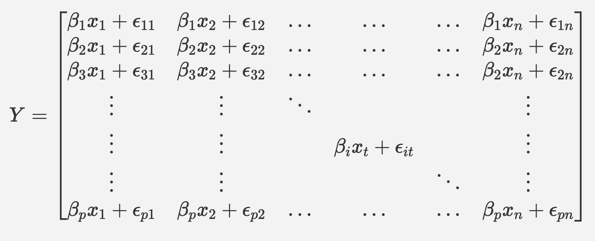

# Shuai Yang’s Project Portfolio
Welcome to my project portfolio! This page highlights key academic and personal projects I've worked on, ranging from data structure implementation to statistical modeling and spectral analysis. Each project highlights my ability to combine theoretical understanding with practical problem-solving. Below, you’ll find detailed descriptions and links to project files. Thank you for visiting, and I hope you enjoy exploring my work!

| **Table of Contents**                                                                 |
|:----------------------------------------------------------------------------:|
| [Binary Search Tree Data Structure Implementation](#binary-search-tree-data-structure-implementation) |
| [Spectral Properties of Random Matrices](#spectral-properties-of-random-matrices) |
| [Contacts](#contacts)  |

 

## Binary Search Tree Data Structure Implementation
### Overview:
This project implements a Binary Search Tree (BST) to manage cars for a used car dealership. Each car has a defined make, model, year, and price. Cars are organized in the BST where nodes are sorted lexicographically by make and model. Within each node, cars with the same make and model are stored in a Python list, preserving their insertion order.

The system also supports adding, managing, and removing cars efficiently while maintaining the BST property. Thorough testing ensures correctness and robustness of the implementation.
### Components:
1. [Car](https://github.com/YangS-02/YangS-02.github.io/blob/main/Binary%20Search%20Tree%20Data%20Structure%20Implementation/Car.py
) Class:
   - **Initialization**: Constructs a Car object with the provided make, model, year, and price attributes;
   - **Comparison Operators**: Implements overloaded comparison operators:
      - `__gt__(self, rhs)`
      - `__eq__(self, rhs)`
   - **String Representation**: Provides a custom string representation via the `__str__(self)` method for Car objects.
   - **Key Features**:
      - Custom Comparison: Allows cars to be compared using the `>` and `<` operators based on a predefined order of attributes;
      - Readability: Provides a clean string representation of car details with the `__str__` method.
2. [CarInventoryNode](https://github.com/YangS-02/YangS-02.github.io/blob/main/Binary%20Search%20Tree%20Data%20Structure%20Implementation/CarInventoryNode.py) Class:
   - **Initialization**: Constructs a node object with make, model, cars (a list of car objects with the same make and model), parent, left, and right;
   - **Node Operations**: Implements methods such as `get_make(self)`, `set_parent(self, parent)`, and `Node_total_price(self)`;
   - **String Representation**: Overloads the string operator to allow us to get the details of all cars in the CarInventoryNode.
   - **Key Features**:
      - Node Grouping: Groups cars by make and model;
      - Custom Comparison: Implements __lt__ and __eq__ for node comparisons.
3. [CarInventory](https://github.com/YangS-02/YangS-02.github.io/blob/main/Binary%20Search%20Tree%20Data%20Structure%20Implementation/CarInventory.py) Class:
   - **Description**: This class provides key functionality to add, search, retrieve, remove, and traverse cars in the inventory, while ensuring the integrity of the BST structure. It is designed for hierarchical organization and supports operations like finding the "best" or "worst" car and calculating the total inventory price.
   - **Key Features**:
      - Efficient Searching: Uses a recursive search method to quickly locate nodes or cars;
      - Traversal Support: Supports in-order, pre-order, and post-order traversals for tree visualization;
      - Car Removal: Robust handling of node deletion, including complex cases with children nodes.
4. [Test file](https://github.com/YangS-02/YangS-02.github.io/blob/main/Binary%20Search%20Tree%20Data%20Structure%20Implementation/testFile.py):
   - Tests cases to ensure all functionalities work correctly.
### Reflections

- I gained a thorough understanding of how BSTs operate, including node insertion, traversal, and deletion while maintaining the BST property.
- I improved my ability to organize code using class hierarchies and encapsulation.
- I improved my debugging skills by systematically isolating issues and ensuring the correctness of BST operations.
- I practiced writing clean, well-documented code that is easy to understand and extend.

 

## Spectral Properties of Random Matrices
### Overview:
This [folder](https://github.com/YangS-02/YangS-02.github.io/tree/main/Spectral%20Properties%20of%20Random%20Matrix%20Theory) contains Python code exploring the Marchenko-Pastur distribution and its application to random matrix theory and stock return modeling. It includes simulations comparing distributions (e.g., Student’s t-distribution) and evaluating their impact on key results.
### Description:
* Simulation of Marchenko-Pastur Law with [Normal entries](https://github.com/YangS-02/YangS-02.github.io/blob/main/Spectral%20Properties%20of%20Random%20Matrix%20Theory/Simulations/Marchenko_Pastur_Normal.py):
   - Constructs random matrices based on given variance, number of features, and aspect ratio;
   - Computes the eigenvalues of the empirical covariance matrix;
   - Implements Marchenko-Pastur density;
   - Validates the total mass under the density curve;
   - Produces histograms of eigenvalues and overlays the Marchenko-Pastur density for comparison.
* Simulation of Marchenko-Pastur Law with [Student-t entries](https://github.com/YangS-02/YangS-02.github.io/blob/main/Spectral%20Properties%20of%20Random%20Matrix%20Theory/Simulations/Marchenko_Pastur_Student.py):
   - Constructs random matrices based on given degree of freedom, number of features, and aspect ratio;
   - Computes the eigenvalues of the empirical covariance matrix;
   - Implements Marchenko-Pastur density;
   - Validates the total mass under the density curve;
   - Produces histograms of eigenvalues and overlays the Marchenko-Pastur density for comparison.
   - Key Result:
      - When the degrees of freedom is small (close to 2), the eigenvalues tend to cluster near zero, leading to deviations from the Marchenko-Pastur distribution. This makes MP unreliable for such data.
* Simulation of Marchenko-Pastur Law with a [one-factor model](https://github.com/YangS-02/YangS-02.github.io/blob/main/Spectral%20Properties%20of%20Random%20Matrix%20Theory/Simulations/Marchenko_Pastur_Spike.py):
   - Constructs random matrices based on:
      - Let $\beta\in\mathbb{R}^{p}$ be a fixed vector representing the sensitivity of an asset’s return to a single market factor,
      - Let $x\in\mathbb{R}$ be a random variable representing the market factor and distributed as $\mathcal{N}(0,\,\sigma_x^{2})$;
      - Let $\epsilon\in\mathbb{R}^{p}$ be the a random vector representing random returns for each stock, and is distributed as $\mathcal{N}(0,\,\sigma_\epsilon^{2})$;
      - Consider $x_t$ to be one realization of the market factor at time $t$, where $t=1,2,\dots ,n$.  The sensitivities of assets’ return to the market factor remains constant across time. Random returns are distributed as $\mathcal{N}(0,\,\sigma_\epsilon^{2})$ at each time. Thus, $y_{it}=\beta_{i} x_t+\epsilon_{it}$. Now, if we take $n$ Independent and identically distributed copies of $y_j$ and organize them into a matrix $Y\in\mathbb{R}^{n\times p}$, with each column corresponds to an independent realization of $y_j$: 
   - Computes the eigenvalues of the empirical covariance matrix;
   - Implements Marchenko-Pastur density;
   - Validates the total mass under the density curve;
   - Produces histograms of eigenvalues and overlays the Marchenko-Pastur density for comparison.
   - Produces histograms of the entries of the leading eigenvector of the empirical covariance matrix overlaid with entries of normalized vector $\frac{\beta}{||\beta||}$, with additional statistics displayed on the plot for clarity.
   - Key Results:
      - The bulk of the eigenvalues follows the Marchenko-Pastur (MP) law, resembling the eigenvalue distribution of empirical covariance matrix of noise;
      - The entries of the leading eigenvector (or the spike) align well with the normalized signal direction $\frac{\beta}{||\beta||}$
### Reflections
- I gained a solid understanding of the Marchenko-Pastur (MP) law;
- I investigated how heavy-tailed noise (modeled using the Student-t distribution) deviates from the classical Gaussian case;
- I explored how introducing a low-rank "signal" (spike) into a high-dimensional noise matrix influences the spectral properties.
In general, this project has strengthened my problem-solving, programming, and analytical skills, all of which are critical for tackling high-dimensional data in both academic and professional settings.
### Some words:
This project is still a work in progress as I continue to refine my analysis. The next step is to investigate financial data and compare the results. The code and results presented here represent key components of my methodology, showcasing how I generate, simulate, and analyze random covariance matrices. However, only selected portions of the code and preliminary results are included to provide a focused overview.
### Acknowledgments
Special thanks to Professor Alexander Shkolnik, Assistant Professor at UCSB, for providing foundational guidance and starter code for this project. His insights on random matrix theory and its applications were instrumental in shaping this work.

 

## Contacts
E-mail: Shuaiyang@ucsb.edu

